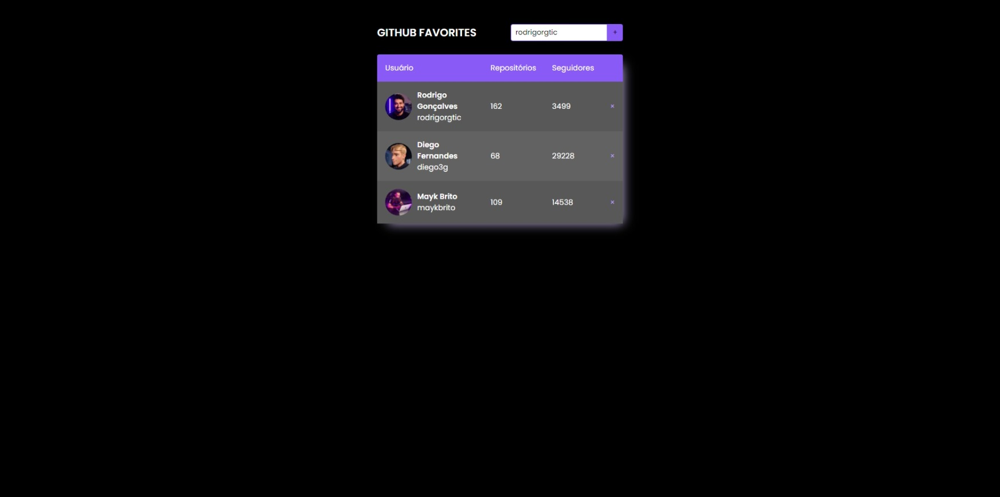

<h1 align="center"> Stage06  Github Favorites</h1>

  <a href="#-tecnologias">Tecnologias</a>&nbsp;&nbsp;&nbsp;|&nbsp;&nbsp;&nbsp;
  <a href="#-projeto">Projeto</a>&nbsp;&nbsp;&nbsp;|&nbsp;&nbsp;&nbsp;
  <a href="#-layout">Layout</a>&nbsp;&nbsp;&nbsp;|&nbsp;&nbsp;&nbsp;
  <a href="#memo-licença">Licença</a>

  

 
  

  

## 🚀 Tecnologias

Esse projeto foi desenvolvido com as seguintes tecnologias:

- HTML 
- CSS
- Git e Github
- Figma
- Javascript

## 💻 Projeto

 Esse projeto é uma aplicação web simples que permite aos usuários pesquisar perfis do Github e exibir as informações como quantidade de repositórios e seguidores, junto com um link que leva para o perfil da pessoa no github.

<h2> Conceitos aprendidos em aula</h2>

  <ul>
  <li>Construção de tabelas no Html</li>
  <li>Criando classes e heranças no Javascript</li>
  <li>Imutabilidade</li>
  <li>LocalStorage</li>
  <li>Métodos Estáticos e Promessas</li>
  <li>Promessas com Async Await</li>
  <li>Cuidando do fluxo da aplicação com Try, Catch e Throw</li>

  </ul>
      
 

- [Visite o projeto online](https://iaraMarques.github.io/Github-Favorites)

 

## :memo: Licença

Esse projeto está sob a licença MIT.

---

Feito com ♥ by Iara Marques :wave: [Participe da comunidade da RocketSeat!](https://discord.gg/rocketseat)
